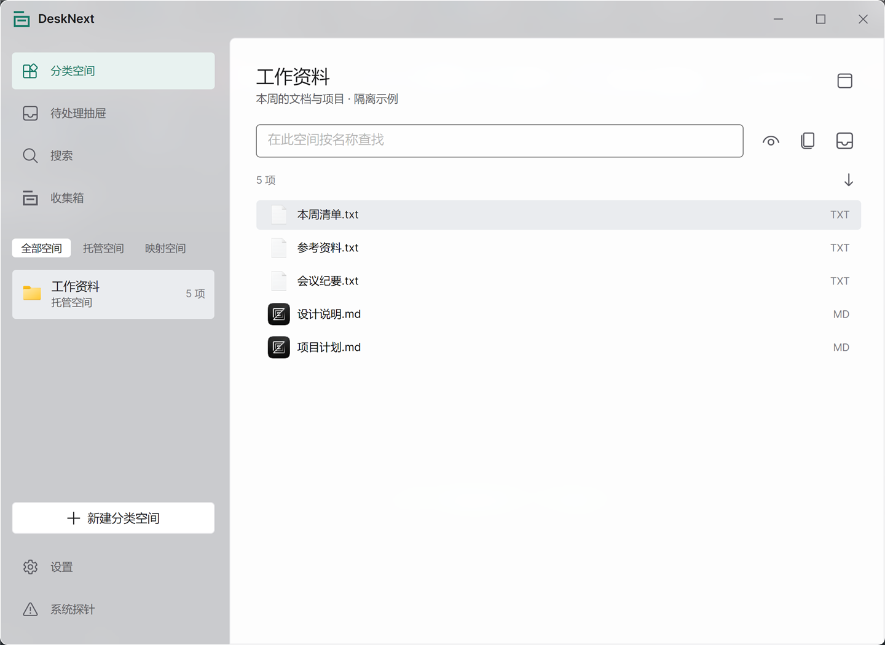

<div align="center">


# DeskNext

**A clearer workspace for your files.**

Organize in desktop spaces. Review AI suggestions. Keep control of every move.

**English** · [简体中文](README.zh-CN.md)

[Getting started](#getting-started) · [Model package](https://github.com/WSXYT/DeskNext/releases/tag/model-laya-multilingual-fp32-v1) · [Roadmap](PLAN.md) · [License](LICENSE)

</div>

> **Development preview.** The safe manual local-file workflow is implemented. AI deployment and the broader feature set are still in development. Model suggestions do not automatically move your files; this is not a signed production release.



*An actual Windows application capture, cropped to exclude other desktop applications. The files shown are isolated examples. Appearance varies by OS, theme and display scale.*

## A workspace, not another folder pile

- **Spaces that fit your workflow.** Keep files in app-managed spaces or map an existing folder without moving its contents. Open a space in its own window, choose list/grid/details, and save its placement.
- **Familiar file actions.** Open, reveal, preview, rename, cut/paste, move between spaces, and undo eligible recorded operations. Confirm external imports before anything moves. Managed deletion uses an application recovery area; removing a mapped reference does not delete the original.
- **A quieter desktop.** Use the compact collection capsule to gather items for review, find cataloged files across spaces, and return through the tray. Space and capsule windows are not always-on-top by default.
- **AI you can review.** Use local Laya CPU inference or an explicitly consented Jev cloud preview. Ambiguous names and unsuitable categories remain review items. A suggestion fills a target choice—it is not authorization to move a file.
- **Make it yours.** Light, dark and system themes; custom accent colors; Windows accent/wallpaper color sampling; app-only custom icons; twelve interface languages, including Simplified Chinese, Traditional Chinese, English and RTL Arabic.

## What works today

| Area | Current scope |
| --- | --- |
| Local file and directory organization | Journaled moves, identity-checked undo and confirmed imports on Windows, macOS and Linux |
| Copy/paste | Cataloged items on Windows NTFS; source preserved, no copy-undo claim. Unix supports cut/paste, not in-app copy publication |
| File-manager interaction | File/directory workflows checked with Explorer, Finder and Nautilus; Linux evidence uses X11/Xvfb, not native Wayland |
| Classification | Read-only local CPU and Jev previews, pending-item suggestions and explicit target selection |
| Model installation | Separate pinned model package; verification and installation prepare a new directory, with explicit settings save to activate |
| Folder observation | Explicit, per-source observation into the review queue; no automatic desktop takeover |

These are bounded capabilities, not a claim that every OS version, filesystem, virtual-file payload or failure mode is supported. See the [feature ledger](docs/planning/feature-tracker.md) for detailed coverage.

## Getting started

### Run from source

Install the [.NET 10 SDK](https://dotnet.microsoft.com/download/dotnet/10.0), then:

```sh
git clone https://github.com/WSXYT/DeskNext.git
cd DeskNext
dotnet restore DeskNest.sln
dotnet build src/DeskNest.App -c Release -m:1 -p:UseSharedCompilation=false
dotnet run --project src/DeskNest.App -c Release --no-build
```

The internal solution, project names and existing data paths remain `DeskNest.*` for compatibility. The displayed product name is **DeskNext**.

Windows x64, Linux x64 and macOS ARM64 have native verification evidence. Additional architectures, installation paths and system integrations remain tracked separately. For native bridge build details, see [architecture](docs/architecture.md) and the [verification reports](docs/planning/p1-report.md).

### First useful steps

1. Complete onboarding; you can start with manual organization before configuring a model.
2. Create a managed space, or map an existing local folder and catalog its direct contents.
3. Drop an external file or folder into a space. Review the source and destination, then confirm the import.
4. Use the file menu or Operation History to undo an eligible operation. Changed or unverified files are not silently overwritten.
5. Open an independent space window or the collection capsule when you want a smaller desktop surface.

### Optional classification

**Local Laya:** obtain the separate [multilingual FP32 model package](https://github.com/WSXYT/DeskNext/releases/tag/model-laya-multilingual-fp32-v1) (about 813 MB / 775 MiB). In Settings, choose Laya and use **Download model**, or install the ZIP offline, then save the verified model-folder setting. Downloads can resume after interruption when supported by the server. You can also select an already-extracted compatible bundle. Runtime inference needs neither Python nor a cloud API key.

**Jev:** choose Jev in Settings, enter your TypeSafe key, and explicitly permit sending before requesting a preview. Requests contain filenames, item types and category descriptions—not file contents or absolute paths. API usage may be charged. Sending consent is session-only; Windows offers optional, explicit Credential Manager storage for the key.

### Windows development package

```powershell
powershell -NoProfile -File build/Publish-Windows.ps1 -Version 0.4.0-dev
```

This produces an **unsigned development bundle**, not a final installer. Installation, side-by-side versions and data-preserving uninstall are explained in [the package guide](build/windows/README.md). Model weights are distributed separately and are never committed to this source repository.

## Local-first, with explicit boundaries

- Your files remain ordinary files. Managed and mapped spaces have different, visible semantics.
- A failed identity or recovery check retains evidence rather than guessing what to move or delete.
- Previewing does not execute file contents. Outgoing system drags export Copy references and never delete their sources.
- No silent switch from local inference to a cloud provider; no API keys in workspace JSON.
- Checksums pin model bytes. They are **not** a publisher signature or proof of classification quality.

Back up important data. Recovery journals are not a substitute for backups, and the preview is not yet a guarantee of power-loss durability or unattended organization.

## Development status

The project is advancing through [P0–P7](PLAN.md). The user-approved P3 manual-workflow scope is accepted; P4 AI deployment is in progress. Continuous automation/Flow, remaining productivity and backup features, and signed cross-platform release acceptance remain on the roadmap.

For implementation details: [P3 manual operations](docs/planning/p3-report.md) · [P4 classification and deployment](docs/planning/p4-report.md) · [Feature coverage](docs/planning/feature-tracker.md).

Bug reports should include OS, app revision, reproduction steps and sanitized diagnostics. Do not upload private files, API keys or recovery records containing sensitive paths.

## License and acknowledgements

DeskNext source is licensed under **[GPL-3.0-only](LICENSE)**. Third-party components and model assets retain their own licenses; see [THIRD_PARTY_NOTICES.md](THIRD_PARTY_NOTICES.md).

Thanks to [DeskBox](https://github.com/Tianyu199509/DeskBox), [PoggetCore](https://github.com/EnderMo/PoggetCore), [Laya](https://github.com/NandhaKishorM/laya), Avalonia and Microsoft Fluent UI System Icons. Pinned versions and adaptation notes are recorded in [docs/upstream.md](docs/upstream.md).
